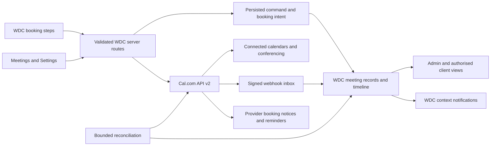

# Cal.com meetings for WDC

Status: proposal for owner review. No booking integration or production schema change has been made.
Prepared: 5 October 2026. Research describes current official documentation; account-specific capabilities still need a credentialed proof after approval.

## 1. The proposed experience

Offer two clear ways to begin: **Tell us about your project** and **Schedule a meeting**. Keep the existing enquiry/contact submission working. Build the booking journey and Meetings workspace with WDC components; use hosted Cal.com API v2 for scheduling, connected-calendar conflicts, bookings, conferencing and supported automation.

The owner remains the initial host. Staff manage authorised studio meetings without gaining the owner's calendar credentials. Clients can book without creating a WDC account, and signed-in clients can see meetings linked to their own client/project records.

The recommended first release is complete for one host: public booking, weekly and exceptional availability, calendar/agenda, requests, confirmation, rescheduling, cancellation, meeting links, reminders, secure guest management, client/project linking, reconciliation and operational health. Multiple hosts, round-robin, paid appointments and recurring series are later extensions, not hidden prerequisites.

### Decisions proposed for review

| Decision | Recommendation | Why |
|---|---|---|
| Scheduling service | Hosted Cal.com, supported API v2 | Avoid a second application/database to patch and operate. This supersedes the older self-host-and-link proposal in `WDC_Admin_Platform_Research.md` for this feature. |
| Interface | Native WDC booking screens and admin controls | Full typography, theme, accessibility and responsive control. An iframe cannot reliably reproduce our central system. |
| Initial host | Owner's Cal.com account using `wedigcreativity@gmail.com` and its connected calendar | Owner confirmed this email on 5 October 2026. Verify the account ID and calendar access before mapping it to WDC. |
| First public appointment | Project conversation, suggested 30 minutes | One clear offer instead of asking prospects to understand a catalogue of services before talking. Duration is editable. |
| Private appointment | Project check-in, suggested 30 minutes | Client/project context and private invitations; not a second public funnel. |
| Approval | Instant confirmation initially; configurable per meeting type | Requests needing review have a distinct pending state and no promise of a confirmed meeting. |
| Availability defaults | Owner chooses hours; suggest 24-hour notice, 15-minute buffers, 30-day horizon | Do not invent a working week or publish bookable hours before setup. These are suggested controls, not configured values. |
| Reminders | Cal.com owns scheduling reminders; WDC owns internal updates and client/project context | Prevent two systems sending the same reminder. Confirm custom workflow and delivery visibility entitlements first. |
| Meeting medium | Google Meet if owner connects it; allow supported alternatives | Never manufacture a video URL or imply the WDC Google login granted calendar access. |
| Fees | No payment step in release one | Booking a conversation is not buying a project. A paid consultation needs a separate payment/refund design. |

### Hosted or self-hosted

Recommendation: hosted Cal.com for WDC's production booking service. Our own WDC interface still controls the public journey and admin design; hosting the scheduling engine elsewhere does not require exposing Cal.com's dashboard to clients.

Current official self-hosting guidance has changed since the older WDC research note: `calcom/cal.com` now redirects to `calcom/cal.diy`. Cal.diy is MIT-licensed, but the maintainers recommend it for personal, non-production use and explicitly remove Workflows, Teams, Organizations and other commercial features. Commercial on-premises access is a separate sales route. Do not treat an older AGPL/open-core Docker guide as the current full-feature product. [Official Cal.diy repository](https://github.com/calcom/cal.diy#readme), [current self-hosting site](https://www.cal.diy/).

| Choice | Fit for this plan | Ongoing responsibility |
|---|---|---|
| Hosted Cal.com | Recommended, subject to actual API/workflow entitlement | WDC adapter, permissions, sync/recovery and design; Cal.com operates its scheduling service. |
| Community Cal.diy | Suitable for an isolated experiment; not recommended for this production scope | We operate application/API/database services, upgrades, backups/restore, TLS, OAuth apps, outbound mail, scheduled jobs and monitoring; missing workflow features require a separate design. |
| Supported commercial on-premises | Consider only for a demonstrated data-control requirement | Obtain a current vendor quote and exact feature/API support, then budget deployment and operations. No price assumed. |

Self-hosting is not automatically cheaper: compare infrastructure, support/licence where relevant, maintenance hours and incident recovery, not only the server bill. If requested, run a bounded proof on an isolated host with restore/upgrade and real calendar/reminder tests before any production decision. Do not place it on an existing production/email VPS or reuse WDC's CockroachDB by assumption. Hosted API portability is a design goal; moving provider later still requires a tested booking/calendar migration and cannot be promised as swapping one URL.

## 2. What exists today

The reconciled main checkout at the start of planning is `59450634a1c5d62ce16f14e9b7817c1ff57c48b8`, equal to GitHub `main` with zero ahead/behind and no tracked diff. See the companion Git reconciliation report for preserved historical branches.

- `/contact` renders `ContactForm` and sends to `/api/contact`.
- `/start` is a new four-screen conversation using `CustomFormView`; it also sends to `/api/contact`. `/services` can prefill selected services into `/start`.
- `/onboarding` is a separate client brief, already noindex. Booking must not replace it or make a meeting count as a paid/approved project.
- `components/admin/integrations-panel.tsx` correctly marks Cal.com **Not built**. No existing working scheduling integration was found.
- `components/admin/shell.tsx` owns the existing dashboard shell. Its task pages are Dashboard, Clients, Projects, Money, Forms and Blog, with Settings in the utility group.
- `lib/admin/permissions.ts` owns role permissions; staff currently lack settings, books and destructive privileges.
- `README.md` design-system rules and actual components are authoritative. The external Design System artifact could not be fetched by the research tool, so this proposal uses the repository's verified specification and component inventory.
- Existing reusable pieces: `Pick`, `DateInput`, `DateTimeInput` in `pick.tsx`; `DateRange`; form kit; Settings save bar; `confirm`; `toast`; `TableScroll`; `AdminState`/`EmptyScene`; skeletons; role-aware tours; email outbox/message log; audit log; client/project records; form entry links.

## 3. Which inspiration we use

The attached screenshots are references for interaction and composition, not assets to publish or instructions to import another brand.

| Reference images | Keep | WDC adaptation |
|---|---|---|
| 1 and 4 | Short steps, visible progress, selectable choices | Existing WDC conversation/step patterns; real meeting types, no travel/medical cards or photography. |
| 2 and 3 | Stable meeting summary beside date/time and details | Desktop summary column; mobile compact summary with an expandable details control. No payment step or fabricated host portrait. |
| 5, 9 and 10 | Clear calendar toolbar, Today, date navigation, week/month views | Existing admin head and panel geometry. Events carry WDC solid status tags rather than pastel washes. |
| 12 | Calendar beside a detail panel with attendee and action context | Authorised meeting detail, timeline, linked client/project, reminders and join action. No new chat system or asserted RSVP data. |
| 6, 8, 11, 13 and 14 | Compact month selector plus selected-day agenda and focused meeting detail | Mobile default. Preserve the dashboard drawer; no floating bottom tab bar, rainbow palette or in-app video-call controls. |
| 7 | Useful agenda/week navigation | Exclude class attendance, kiosks, memberships and other unrelated administration. |

We will not clone every reference, introduce draggable events in release one, build video conferencing inside WDC, or use colour as the only event/status signal.

## 4. Public booking flow

### Entry points and routes

- `/start`: keep its existing hero and enquiry flow. Add a clear choice before filling it: **Tell us about your project** or **Schedule a meeting**. An existing enquiry draft is retained locally when switching, never silently submitted.
- `/contact`: retain the form and offer the same meeting option beside the channel choices. It must remain usable if Cal.com is unavailable.
- `/meet`: canonical WDC booking page, using the established `wk-hero`, Header and footer. Loading booking code happens on this route or after genuine intent, never on every public page.
- `/meet/manage/<opaque-token>`: guest meeting management. Noindex, private response caching, no third-party trackers, no personal data in URL parameters. GET views; POST changes. A booking UID alone is not authorisation.
- Portal: contextual meeting panel on the dashboard/client's project and `/portal/meetings` if needed; use existing portal navigation patterns and permission filtering.

The public `/meet` explainer can be indexable with truthful metadata; management, confirmation and personal booking-status routes are noindex and excluded from the sitemap. Do not use robots disallow as the only protection for personal content.

### Four screens

1. **Your meeting:** public meeting type, purpose, duration and medium. If there is only one type, preselect it and avoid a redundant decision. Carry selected services from `/start` as context, not as an untrusted provider event ID.
2. **Date and time:** one-month calendar, available dates, selected-day time slots, explicit timezone and searchable timezone picker. Show duration and format beside the slots. Offer next available day and another month. No slots is different from a provider error.
3. **Your details:** name, email, optional phone/company, short purpose and optional guests if enabled. Signed-in people can prefill their verified account details. Reuse server email/temporary-inbox rules. Keep contact data in component/session memory; no permanent browser storage by default.
4. **Review and book:** meeting, date, time, timezone, attendee and medium, with Edit links. Label the actual action **Book meeting** or **Request meeting** according to approval mode. The summary remains legible at 320px and under long names.

After provider confirmation and local persistence, show confirmed/requested state, an email status that reflects what is actually known, add-to-calendar, secure manage link and return to project/contact options. Show a real meeting link only when supplied by Cal.com. A pending video link says **Meeting link is being prepared** and has a refresh/recovery route; it never appears as a disabled unexplained button.

Back navigation retains answers. Changing type/duration/date releases any old hold and refreshes slots. Changing timezone preserves the selected instant where still valid and displays its new local date/time before final confirmation. A browser refresh can resume using an opaque draft identifier; it does not expose email, purpose or reservation credentials in the URL.

## 5. Meetings workspace

### Navigation and permissions

Add **Meetings** at `/admin/meetings` to the task navigation. Six operational pages become Dashboard, Clients, Projects, Meetings, Money and Forms, with Blog as the existing seventh task-page exception; Settings remains utility navigation. Do not add separate sidebar pages for calendars, reminders and event types.

Within Meetings use **Schedule**, **Requests**, and **History** tabs. Schedule offers Agenda/Day/Week/Month view controls. Configuration belongs under **Settings > Meetings**, reached from a clear control on Meetings; the owner manages the shared host. Staff have safe, explicit operational permissions and cannot touch credentials or the owner's availability by default.

| Person | Allowed | Boundary |
|---|---|---|
| Owner | All studio meetings; approve/decline, create/invite, reschedule/cancel, link records, availability, event types, reminders and health | Provider connection is verified against the intended account. |
| Staff | Meetings assigned to them or linked to clients/projects they may access; allowed invitations and operational updates | Server checks each read and action. Owner-host rescheduling/cancellation requires explicit delegation; otherwise offer Request change and notify owner. |
| Signed-in client | Own linked meetings, join, permitted cancellation/reschedule, request another conversation | No attendee-directory, staff notes or other client's meetings. Email matching alone does not grant project access. |
| Guest | Own booking using a hashed management token | No searchable bookings or access from provider UID alone. Guest additions cannot change host or event type. |

### Schedule page shape

Use existing page head with title **Meetings**, a short description, and one head action **Schedule meeting**. A slim next-meeting panel shows the actual next accepted meeting (or a true empty state), not invented KPIs. Toolbar holds Today, previous/next, date label, view picker and filter/search controls. On desktop the calendar occupies the main panel; selecting an event opens a bounded right-hand detail panel. Closing it restores focus to the event.

Meeting blocks show time, title/client and a text status. Overlapping meetings use columns with a minimum readable width and an overflow count opening the day's agenda. A month cell shows at most two readable events plus **N more**. Time-grid height and busy periods are bounded to avoid thousands of empty slots. Calendar keyboard access has an agenda alternative.

Detail includes status, start/end and timezone, attendees/host, actual conferencing location, client/project links, public description, separate staff-only notes, reminder policy, sync freshness and audited timeline. Actions depend on current state and permission. Join opens the trusted provider link; participants' RSVP or attendance is shown only if a reliable provider field supplies it. Elapsed end time is labelled **Ended**, not **Attended**.

Requests: pending booking requests with date, age and owner, plus Approve and Decline with an optional useful response. Declining sends the configured notification and offers the guest an alternative booking/contact route. The owner defines an expiry/review policy so pending requests do not remain unresolved indefinitely.

History: filterable, paginated meeting table. Tables remain tables on phones with a pinned first column and contained sideways scrolling. Cancellation preserves history; cancelled bookings are not silently deleted or confused with Trash. Any local archival/deletion follows WDC's two-step policy and retention rules.

### Admin-created meeting

Choose authorised client/project, type and attendees, then select a genuinely available slot. Use Cal.com creation with validated host/type; no force-conflict/out-of-bounds flags. Show whether the action confirms a booking or creates a request. An invite-to-book link is a separate explicit action when the client should choose the time themselves. Neither invitation nor booking automatically creates a paid project.

## 6. Availability and configuration

The owner can configure the following using the shared Settings save bar and designed pickers:

| Control | Behaviour |
|---|---|
| Weekly hours | Multiple periods per day, copy one day to selected days, closed days, overlaps rejected. |
| Named schedules | Different availability for project conversations and check-ins; explicit event-to-schedule assignment. |
| Date overrides | A single date or range, extra hours or unavailable dates; preview affected dates before saving. |
| Date windows | Rolling booking horizon or a fixed first/last date, not a change to already-booked meetings. |
| Timezone | IANA timezone, explicit local-time labels, daylight-saving preview. Internal default may be Africa/Lagos; public copy avoids city names. |
| Notice and buffers | Minimum notice, before/after buffer, slot interval and meeting duration. |
| Limits | Supported per-day/week meeting limits and horizon; show unsupported controls as explained, not simulated. |
| Out of office | Bounded date range with a clear return; holidays are explicit owner choices, not assumptions. |
| Booking policy | Public/private types, approval mode, cancellation/reschedule cutoff and guest allowance. |
| Destination/conflict calendars | Cal.com-managed connection; choose where bookings are written and which calendars block time. |
| Medium | Supported connected Google Meet, Cal Video, Zoom/Teams or a configured phone/in-person location. |
| Reminders | Supported schedules/channels per type, preview/template, owner/client preferences and effective policy. |

Range editing expands to provider-supported dated exceptions with a finite cap (proposed 90 dates per save). This is WDC UI behaviour, not a claimed native range endpoint. Read the current provider schedule before editing, merge existing exceptions, and read it back after save; never overwrite unrelated schedules or assume PATCH array merge semantics. Retry only after resolving uncertain saves. Booking policy windows and recurring hours are separate concepts.

Changes show affected event types and future availability. Existing confirmed meetings remain in place; changing availability does not quietly cancel or move them. Offer a separate guided reschedule action if needed. Saved values are read back from Cal.com and then reflected in WDC. External Cal.com edits are recognised through refresh/reconciliation; no competing WDC schedule calculator.

## 7. Account, calendar and video connection

The owner confirmed `wedigcreativity@gmail.com` as the host email on 5 October 2026. An existing Cal.com username/account ID and its connected-calendar state are not yet verified. After approval, verify `/me` against this identity and store a provider account ID plus the WDC owner mapping. The user's recently configured WDC Google login is a separate identity capability; it grants no calendar/Meet scopes.

For one owner, a server-only API key is the proposed smallest setup, conditional on endpoint and plan access. Cal.com recommends OAuth for integrations; ordinary supported OAuth is the upgrade/preferred path if scoped multi-account access is required. Do not use deprecated managed-user/Platform credentials. Staff must not share the owner's Cal.com password. If provider or WDC roles do not support delegated actions safely, use request-to-owner until the permission path is proven. [API authentication and current Platform status](https://cal.com/docs/api-reference/v2/introduction).

Google Meet requires the relevant Google Calendar connection. Connect calendars/conferencing in Cal.com's secure account flow, then return to WDC for connection checks. Apple/iCloud calendar connection is distinct from viewing an ICS invite on an iPhone; an ICS download does not supply conflict checking or continuous two-way sync. Apple app-specific credentials, if required by the provider, remain in Cal.com, never WDC forms or logs. [Google conferencing prerequisite](https://cal.com/docs/atoms/conferencing-apps), [Apple connection reference](https://cal.com/docs/atoms/apple-calendar-connect).

Integration health must distinguish **Not configured**, **Connecting**, **Ready**, **Calendar reconnect needed**, **Conferencing unavailable**, **Rate limited**, and **Sync delayed**. Ready requires authenticated identity, allowed event types, slot reading, a valid destination/conflict-calendar setup and webhook configuration. An API key's mere presence is not readiness. Provide the exact owner recovery action and a contact fallback for guests.

## 8. Technical ownership and data flow

Cal.com owns bookable availability, booking lifecycle, external calendar records and conferencing. WDC stores a projection for its dashboard and its own client/project context. Server API responses update the local projection immediately; webhooks converge it for external changes. Local client/project links and staff notes do not get overwritten by provider sync.

Suggested module: `lib/cal/` containing configuration, endpoint-version map, client, validation, booking commands and sync. `lib/meetings/` owns WDC queries, authorisation and projection. Use existing database pool, settings, audit, form and outbox primitives. No second database, self-hosted Cal stack, separate worker fleet or calendar package is assumed.

Suggested server routes: read slots; bounded reservation; create/check booking intent; secure manage/cancel/reschedule; Cal webhook. Admin server actions handle owner settings, approval and linking. Every action rechecks permission and record ownership. Public payloads cannot choose arbitrary host/event IDs, force conflicts, skip limits, inject meeting URLs or attach themselves to a client/project.

### Proposed persistent records

| Record | Minimum purpose/constraints |
|---|---|
| Provider connection | Owner/provider ID mapping, enabled state, last successful probe; references server-managed secret, not its value. |
| Meeting type mapping | Allowlisted provider event ID, public/private visibility, schedule ID, policy and WDC copy. |
| Meetings | Unique provider booking UID, provider status, UTC start/end, original timezone, safe location, owner/host, restricted attendees, sync timestamp, optional client/project links. |
| Booking intents/commands | Unique dedupe key, session/actor binding, operation, payload fingerprint, pending/succeeded/failed/unknown state, provider UID and safe error. |
| Guest management tokens | Cryptographically random token hashes, meeting binding, scope, expiry, revocation/rotation; separate view from destructive authority where needed. |
| Webhook inbox | Unique delivery identity or canonical digest, receipt time, type/booking UID, processing status and bounded attempts; protected minimal payload. |
| Meeting events | Append-only transition/actions with actor, reason and provider occurrence time; no secrets or raw browser transcripts. |

Schema names and migration numbers are provisional. Allocate the next unused migration at implementation time after Git/database reconciliation. Ship the migration and apply production through Settings > System as owner. No schema is applied in this planning phase.

### Truthful booking and retry rules

1. Validate slot selection against current provider availability. If supported, reserve only after the visitor chooses a slot; bind the provider reservation to the draft and enforce short expiry/one active hold. Release on change/cancel; expiry is the backstop for closed tabs. Verify how reservation credentials reach create-booking in a contract test before claiming race protection.
2. Validate identity and fields, then persist a booking intent/dedupe key before calling Cal.com. Send only allowlisted booking fields and minimal opaque WDC correlation metadata. Do not enable conflicts, out-of-bounds or skip-limits options.
3. The browser waits for the provider result because a booking cannot be called successful before the service accepts it. Bound that request; record uncertain outcomes rather than fabricate success. The repository's no-third-party-before-response rule still applies to ancillary SMTP/reminders: answer with durable pending intent if provider latency exceeds the request budget, then converge safely.
4. If the request times out after Cal.com may have accepted it, mark **Checking booking** and query/reconcile by correlation metadata/UID and signed webhook. Do not blindly POST again. Verify provider lookup/idempotency capabilities; if correlation cannot be queried reliably, keep the command uncertain and require reconciliation/support rather than risk double booking.
5. If Cal.com succeeds but local persistence fails, the prior intent and webhook allow recovery. If a webhook arrives first, unique provider UID/upsert prevents duplicate meetings. A repeated browser request returns the same intent result.
6. Show Confirmed only for provider-accepted bookings; Requested for pending approval; cancelled/rescheduled states come from verified commands/provider updates. A slot collision returns the visitor to refreshed slots without losing details.

### Synchronisation and reliability

- Verify `x-cal-signature-256` against the raw body using the configured secret and constant-time comparison. Missing/malformed signatures fail closed. Size-limit payloads, validate account/event scope and persist the inbox row before returning success. Do not return success if persistence fails. [Webhook signature guidance](https://cal.com/docs/developing/guides/automation/webhooks).
- Treat delivery as duplicate-prone and unordered. If provider events lack a trustworthy revision, re-fetch the booking's canonical state rather than let an older webhook resurrect a cancellation. Unique constraints and audited command states protect race conditions.
- Process after the response only with a durable receipt. Vercel `after()` is an execution opportunity, not a guaranteed queue. Use bounded retries, a visible failed-inbox list, owner Retry and a scheduled reconciliation backstop; inspect existing deployment/scheduling facilities before choosing a runner.
- Read a bounded rolling booking window on reconciliation, paginate completely, and revisit uncertain commands/cancelled records so missed events do not strand them. Persist cursor/time, checkpoint each batch and expose last success/failed count. Refresh-on-read is additional recovery, not a substitute for unattended recovery.
- While Meetings is visible, target an initial 30-second refresh plus refresh on focus/reconnect/action; pause while hidden, preserve selected date and user scroll. Show actual last synced time. This is eventual update, not a claim of instant realtime.
- Estimate: one open dashboard at two polling reads/minute plus one month slot read and selected-day refresh per visitor. A burst of 20 active visitors needs a measured provider-request budget before release. Coalesce duplicate reads, bound ranges and use small optional slot-read caching, never stale booking writes. Cal.com currently documents a 120-request/minute API-key limit; handle 429 with Retry-After and jitter rather than add infrastructure speculatively. [API limits](https://cal.com/docs/api-reference/v2/introduction).

## 9. Endpoint and entitlement proof

Supported documentation is not proof that this owner's subscription/key can call every endpoint. Build an owner-account capability matrix before committing to controls or purchasing a plan.

| Capability | Documented basis | Proof needed before UI ships |
|---|---|---|
| Slot reading | `/v2/slots`, version `2024-09-04` | Timezone/DST, buffer/notice and connected-calendar conflicts. [Slots](https://cal.com/docs/api-reference/v2/slots/get-available-time-slots-for-an-event-type). |
| Slot holds | `/v2/slots/reservations`, version `2024-09-04` | Own hold can be consumed, expiry/release, two visitors racing; no permanent reservations. [Reservations](https://cal.com/docs/api-reference/v2/slots/reserve-a-slot). |
| Booking creation | `/v2/bookings`, current create documentation requires `2026-02-25` | Accepted vs pending, metadata correlation, uncertainty recovery and actual conference generation. [Create booking](https://cal.com/docs/api-reference/v2/bookings/create-a-booking). |
| Booking management | Listing, confirmation, reschedule and cancellation endpoints | Paging, authorisation, old/new UID relationship and policy cutoff behaviour. [List bookings](https://cal.com/docs/api-reference/v2/bookings/get-all-bookings), [Confirm](https://cal.com/docs/api-reference/v2/bookings/confirm-a-booking). |
| Availability editing | Schedule update version `2024-06-11`, weekly periods and dated overrides | Closed-day exceptions, replacement/merge behaviour and range expansion; read-back parity. [Schedules](https://cal.com/docs/api-reference/v2/schedules/update-a-schedule). |
| Type controls | Event-type update surface | Which notice/buffer/horizon/approval controls are writable with this account. [Event types](https://cal.com/docs/api-reference/v2/event-types/update-an-event-type). |
| Reminder configuration | Cal.com Workflows | Exact API/UI management entitlement, channels/credits, opt-out, changes after reschedule/cancel and delivery visibility. [Workflows](https://cal.com/features/workflows). |

Pin API versions per endpoint, not one global date. Normalize provider responses into WDC types and add contract fixtures without private data. Schema/response changes should produce actionable diagnostics, not silent empty calendars. Some attempted generic workflows/conferencing documentation URLs were unavailable during research; those capabilities remain explicit proof items, not guessed endpoints.

The current pricing page lists Individuals as free for one user and Teams at $12/user/month on annual billing, with collaborative/custom capabilities. Treat this as a research snapshot, not a commitment or a guarantee that our full custom API surface is included. Verify the owner's actual account, supported API/workflow access, branding requirements and notification charges. Present the minimum sufficient plan and cost before a purchase. [Current pricing](https://cal.com/pricing).

## 10. Messages, reminders and preferences

Create a single matrix defining the sender for booking confirmed/requested, approved/declined, changed, cancelled, invitation, reminder and internal operational alert. Cal.com should own calendar invites, conferencing and timed reminders. WDC's existing logged outbox sends client/project context or owner alerts only when those are not already provider messages.

Persist WDC message intent/dedupe before SMTP and send after response. A safe key includes provider booking UID, transition/revision, recipient and template. A reschedule cancels/replaces stale reminders; cancellation/decline suppresses them. Reminders are not counted delivered just because configured. Show **Managed by Cal.com** where provider delivery evidence is unavailable, rather than invent a WDC sent timestamp.

Suggested reminder policy for review: email 24 hours and 1 hour before; short-notice bookings skip elapsed reminders. SMS/WhatsApp are off until channel entitlement, credits, consent and country support are verified. Owner/staff notifications belong to each person; optional attendee reminders have a per-booking preference for guests and account preference for clients, enforced in the effective provider policy. If provider workflows cannot honour that safely, do not enable those optional reminders until a proven compatible mechanism exists. Essential booking/service notices remain clear and separate from marketing subscriptions.

Notifications show actual provider status plus WDC failures with Retry where safe. No external messages are sent during research; controlled test messages/bookings are part of the approved implementation and must use owner-approved test recipients.

## 11. Responsive and design specification

| Width | Booking | Meetings |
|---|---|---|
| 1024px+ | Summary beside step body; one month and a wrapping time-slot grid | Week/month calendar and bounded right detail panel; full toolbar. |
| 768–1023px | Summary above body; date and times side by side only if comfortably readable | Calendar uses available width; meeting detail is a dialog/panel, not a crushed third column. |
| 360–767px | One column, short progress labels, compact summary, date then times | Drawer navigation; month selector with selected-day agenda by default; optional Day view; filters in a sheet. |
| 320–359px | Full-width date section with 6px outer inset: seven 44px targets fit 308px, no grid gaps; slot buttons wrap | Same month/day selector geometry; detail opens as an accessible full-height sheet; no clipped actions. |

Keep Week available as an optional contained sideways viewport with pinned time labels, not the default phone experience. Agenda is a deliberate alternative view, not a table converted to cards. History stays a table. Long names/titles truncate only in calendar blocks; the detail/agenda exposes the full content. No viewport-level horizontal overflow.

Use Space Grotesk headings/date figures and Outfit body/controls. WDC navy/orange tokens, solid status fills and light/dark backgrounds; body copy one colour. Public labelled buttons use the existing black/white pair; admin uses `--ad-fill`/`--ad-on-fill`. No new palette, pastel status washes or alpha chips. Preserve existing control/panel radii, spacing, theme switch and header geometry. Date and timezone popovers stay inside viewport/safe areas. Phone inputs use 16px text.

All days, slots and actions support keyboard/focus and accessible names. Monday-first calendar; arrows and month navigation follow existing DateInput behaviour; disabled days explain unavailable state accessibly. Selecting a date announces available slot count; provider errors use an accessible status/error region. Prevent focus loss on refresh; touch targets stay at least 44px. Native mobile scrolling, no Lenis/custom cursor on touch, safe-area padding, no hover-only action. Motion uses transform/opacity, staggered admin arrival and reduced-motion alternatives.

Reuse the existing calendar primitives for presentation while adding booking-specific availability constraints; do not simply use a free-form DateTimeInput to imply availability. If a shared month-grid extraction or time-slot radio component is necessary, update README's design-system table in the same implementation commit. Capture WDC booking and Meetings layouts in both themes before wiring, and rebuild changed Boneyard snapshots if those surfaces use them.

## 12. No-dead-end states

| Situation | Visitor/client outcome | Owner/staff outcome |
|---|---|---|
| No available date | Next available date/month, change type or Send enquiry | Edit availability or inspect conflict calendar. |
| Cal.com unavailable/429 | Retain details, Retry with useful timing, contact fallback; no fake slots | Existing saved calendar with clear stale time; health and retry action. |
| Slot taken/hold expired | Refresh available times; retain details and explain the changed choice | Real state, not optimistic duplicate booking. |
| Create outcome uncertain | Checking booking with durable status route; no rebook button that duplicates | Uncertain command queue with reconcile/check action. |
| Request pending | Requested, expected review guidance and cancel request | Request age, approve/decline and bounded expiry policy. |
| Video link missing | Preparation status, refresh/manage/contact | Recheck provider and reconnect conferencing; no invented URL. |
| Calendar disconnected | Clear booking pause and enquiry option where safe conflict checks are unavailable | Reconnect and validate, then reopen booking. |
| Guest token expired | Secure email recovery, uniform response to avoid enumeration | Owner can revoke/issue replacement; audit. |
| Sign-in expired mid-action | Preserve dialog/draft; new-tab sign-in and retry | Existing WDC session-expiry behaviour; mutation fails closed. |
| Cancellation/reschedule disallowed | Explain cutoff and Request change/Contact | Explicit permission/policy-aware owner action, audited reason. |
| Zero meetings | Friendly calendar icon, why empty, Schedule meeting | Distinct from filtered results, loading, error and no permission. |
| Message/webhook failed | Booking remains honest; safe status/help route | Failure row, retry reason and durable reconciliation. |

All cancel/reschedule/decline actions use the in-app confirmation dialog and toast; irreversible choices include I understand. No action disappears into an unexplained disabled control. After a mutation, reflect persisted truth and refresh related client/project views and next-meeting state.

## 13. Security, privacy, performance and release controls

- Server-only secret naming: proposed `CAL_API_KEY`, `CAL_WEBHOOK_SECRET`, and allowlisted account/type identifiers in owner settings. No `NEXT_PUBLIC_` secret, no arbitrary API-base URL from the browser, no credential value in diagnostics.
- Origin/CSRF/session checks on WDC mutations, separate read/reservation/create/recovery throttles, bot protection where justified. Existing in-memory limits are abuse control, not a durable global quota; provider limits and persisted duplicate controls still apply.
- Opaque management tokens, hashed storage, uniform recovery responses, log redaction, strict private cache policy and no token leakage through analytics/referrers. Redact attendee data from tracing and test fixtures; no personal meeting content in the shared bridge.
- Whitelist supported conferencing hosts/location types; never fetch arbitrary attendee-supplied URLs. Staff notes stay out of provider public descriptions and emails. Client/project linking is authorised server-side.
- Document retention for meetings, tokens, webhook payloads and audit metadata in existing privacy settings. Purge through WDC's established governance, respecting calendar/provider history and data-request handling. Update privacy notice to explain Cal.com processing before launch.
- No Cal embed/SDK on the global marketing critical path. Fetch month/day ranges and paginate histories, avoid render-time network requests in client components, cancel obsolete slot reads and pause polling when hidden.
- Release behind owner enable switch after migration and connection checks. Rollback disables new booking and restores contact choice while preserving existing meetings, management links, webhooks and history. Never drop meeting tables to roll back UI.

## 14. Delivery phases and measurable acceptance

### A. Review and design

- [x] Reconcile main and inventory preserved branch work.
- [x] Inspect current `/start`, `/contact`, integration status and central design rules.
- [x] Review all fourteen references and select relevant interactions.
- [x] Research current supported Cal.com API, pricing and key limitations.
- [ ] Owner reviews this plan; confirms host identity and proposed defaults.
- [ ] Create WDC desktop/tablet/phone booking and Meetings design artifact, including dark and failure states, for review before implementation.

### B. Capability proof and safe setup

- [ ] Verify account/host, subscription and API matrix with actual credentials; no paid upgrade without owner decision.
- [ ] Prove create, hold consumption, approve, cancel and reschedule against controlled test bookings, including uncertainty recovery.
- [ ] Verify Google/iCloud connection and real conferencing invitation on selected test devices.
- [ ] Verify workflow editing, opt-out, delivered-status visibility and scheduled reconciliation route.
- [ ] Finalise data model/migration, notification ownership and endpoint-specific versions. Revise this plan if proof changes the recommendation.

### C. Implementation in complete slices

1. Connection/configuration, migrations, webhook inbox, audit, command persistence and reconciliation.
2. Public booking through real provider confirmation and secure manage/cancel/reschedule, with enquiry fallback.
3. Meetings calendar/agenda, detail, requests, history, staff permissions and client/project context.
4. Availability, exceptional dates/windows, type policy and supported reminders with safe saved/read-back state.
5. Portal context, health/recovery controls, privacy, tours and loading/empty/error states.

Commit/push each finished slice with root checklist and design-system updates; never mark a source edit as a production feature. Keep the public feature disabled until its entire booking/manage/recovery slice passes.

### D. Required verification before release

- [ ] Lint, TypeScript, production build and focused contract/action tests.
- [ ] Two visitors select one slot: one booking accepted; the other recovers without losing answers.
- [ ] Double tap, two tabs and retry: one durable intent and one provider booking; failure after provider acceptance recovers without duplicate mail.
- [ ] Requests approve/decline/expire correctly; cancellation/reschedule suppress old reminders and update all views/calendar invites.
- [ ] Duplicate/replayed/out-of-order webhooks, invalid signature, persistence failure, missed delivery and pagination gaps recover safely.
- [ ] Settings read-back, closed dates/ranges, overlapping windows, DST, international timezone crossing midnight, buffers/notice and booked-calendar conflicts.
- [ ] Owner/staff/client/guest cross-record tampering denied; no arbitrary type/host/meeting URL; expired/revoked tokens and sessions have working recovery.
- [ ] No-config, zero slots, filtered-none, 401, 403, 429, provider outage, lost connection, uncertain save, missing video and failed email all have useful next actions.
- [ ] Responsive visual/interaction checks at 320, 360, 390, 768, 1024 and 1440 in both themes, long content, keyboard, 200% zoom and reduced motion; 44px touch targets and AA contrast.
- [ ] Booking route resource/network measurement; no Cal code on homepage critical path; measured provider request budget and polling paused while hidden.
- [ ] Exact production commit READY at canonical domain, migration ledger/table/index checks, controlled live book/change/cancel cycle, actual host/client email and calendar arrival, video link on iPhone/desktop, reminder timing, recovery/backstop and rollback evidence.

No promise of zero third-party failures: success means failures are visible, persisted where needed, recoverable, and cannot create false confirmation or strand the reader.

## 15. Review points before building

Please review the proposed hosted single-owner start, 30-minute conversation, instant-confirmation default, Google Meet preference, public/private types and reminder policy. Availability itself stays yours to configure. Host email is confirmed as `wedigcreativity@gmail.com`; Cal.com account ID/username and connected-calendar setup remain implementation proof items.

Account-specific API/workflow entitlements, notification delivery evidence, reservation consumption and unattended reconciliation remain proof items. Those are prerequisites for the complete design, not excuses to silently ship fewer controls. If a capability is unsupported, present the choice and revised cost/flow before building it.

This document is the planning artifact requested by the owner. Booking implementation begins only after plan/design review, as requested; no Cal.com account, workflow, meeting, message or credential configuration was changed in preparing it.
